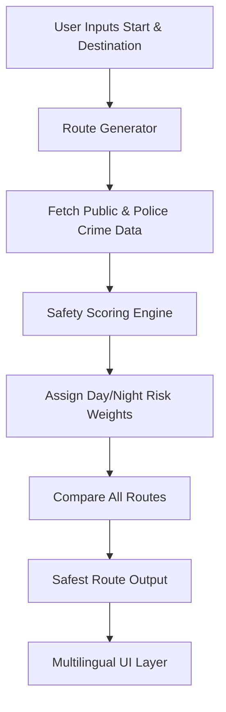
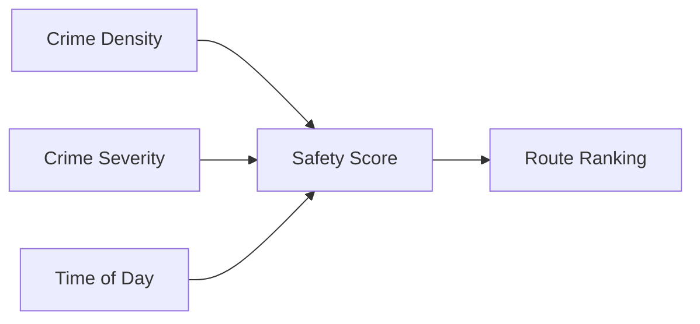

# **AstraaPath – Multilingual Safe‑Route Navigation System**

AstraaPath is a multilingual, AI‑augmented safety‑focused navigation website. A user enters a **starting point** and a **destination**, and the system analyzes **crime datasets**, **public safety reports**, and **police‑released information** to determine the **safest possible route** — separately for **day** and **night** conditions.

AstraaPath also includes **full website internationalization (i18n)** using **react‑i18next**, allowing users to use the platform in multiple languages seamlessly.

---

## 🌍 **Why AstraaPath? (USP)**

* **Safety‑First Navigation** — Instead of shortest‑route logic only, AshaPath prioritizes crime‑aware routing.
* **Day/Night Dynamic Route Selection** — Crime severity and safety vary by time; AstraaPath adjusts recommendations accordingly.
* **Multilingual Interface** — Implemented using `i18next`, supporting quick expansion to 40+ languages.
* **Data‑Driven** — Uses verified public datasets and official police incident records.
* **Modern Stack** — Built with **TypeScript**, **Vite**, **React**, and **i18n** for speed and scalability.
* **Future‑Ready** — Designed to integrate ML models for prediction in later phases.

---

---

# 🧭 **How AstraaPath Works (Architecture Overview)**

## 🔹 **1. User Input Layer**

User enters:

* Starting point
* Destination

A request is generated for route evaluation.

## 🔹 **2. Route Generator**

AstraaPath fetches:

* All possible routes between Point A → Point B
* Road‑segment metadata

## 🔹 **3. Crime‑Safety Engine**

Each route is evaluated using:

* Crime frequency
* Crime severity
* Time‑of‑day weightage

A **Safety Score** is calculated for each route.

## 🔹 **4. Best Path Decision**

The route with the **highest safety score** (not the shortest) is recommended.

## 🔹 **5. Multilingual Layer**

The UI adapts instantly to any chosen language using i18next.

---

# 📊 **System Flow Diagram**



---

# 🌐 **Multilingual Support (i18n)**

AstraaPath uses **react‑i18next** for full website translation.
And readmelingoo for translating the components and the readme. 
The core idea of using the Lingo.dev is to create a welcoming website for all the users of all types, 
across the borders and without the worry of language boundations. 

```
More can be added instantly by creating additional `JSON` files in:
```

### 📌 Example Translation File (`en.json`)

```json
{
  "welcome": "Welcome to AstraaPath",
  "start": "Starting Point",
  "destination": "Destination",
  "findRoute": "Find Safest Route"
}
```

### 📌 i18n Initialization (`src/i18n/index.ts`)

```ts
---

# 🚀 **Getting Started**

## Run Locally

**Prerequisites:**  Node.js


1. Install dependencies:
   `npm install`
2. Set the `GEMINI_API_KEY` in [.env.local](.env.local) to your Gemini API key
3. Run the app:
   `npm run dev`


### 1️⃣ Clone the Repository

```bash
git clone https://github.com/Satyarth-Sahu17/AstraaPath.git
cd AstraaPath
```

### 2️⃣ Install Dependencies

```bash
npm install
```

### 3️⃣ Run the Project

```bash
npm run dev
```

your project will start on a Vite dev server.

---

# 🧪 **Safety Scoring Logic (Simplified)**



Formula (example):

```
safetyScore = (1 / crimeDensity) * weightTimeOfDay * severityFactor
```

---

# 📈 **Future Enhancements**

* Integration with live crime‑reporting APIs
* Predictive ML safety scoring
* SOS emergency assistance
* Heatmap overlays for crime visualization
* Offline navigation support

---

# 🤝 **Contributing**

1. Fork the repository
2. Create a feature branch
3. Commit your changes
4. Open a pull request

---

# 📜 **License**

MIT License

Copyright (c) 2025 Sree Vishishta, Shravani Dhuri and Satyarth Sahu, 

Permission is hereby granted, free of charge, to any person obtaining a copy
of this software and associated documentation files (the "Software"), to deal
in the Software without restriction, including without limitation the rights 
to use, copy, modify, merge, publish, distribute, sublicense, and/or sell
copies of the Software, and to permit persons to whom the Software is 
furnished to do so, subject to the following conditions:

The above copyright notice and this permission notice shall 
be included in all copies or substantial portions of the Software.

THE SOFTWARE IS PROVIDED "AS IS", WITHOUT WARRANTY OF ANY KIND, 
EXPRESS OR IMPLIED, INCLUDING BUT NOT LIMITED TO THE WARRANTIES 
OF MERCHANTABILITY, FITNESS FOR A PARTICULAR PURPOSE AND NONINFRINGEMENT. 
IN NO EVENT SHALL THE AUTHORS OR COPYRIGHT HOLDERS BE LIABLE FOR ANY CLAIM, 
DAMAGES OR OTHER LIABILITY, WHETHER IN AN ACTION OF CONTRACT, TORT OR OTHERWISE, 
ARISING FROM, OUT OF OR IN CONNECTION WITH THE SOFTWARE OR THE USE OR OTHER 
DEALINGS IN THE SOFTWARE.


---

# 📬 **Contact**

For issues or feature requests, visit:
**[https://github.com/Satyarth-Sahu17/AstraaPath/issues](https://github.com/Satyarth-Sahu17/AstraaPath/issues)**

---

AstraaPath — *Because safety should never be optional.*
