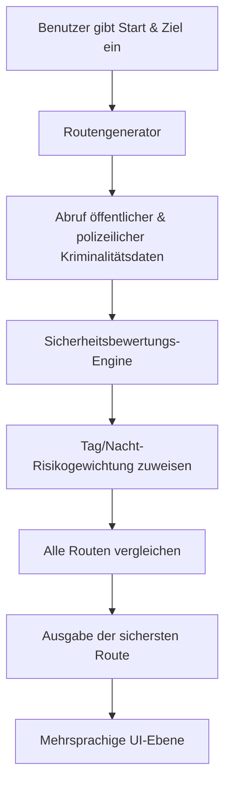
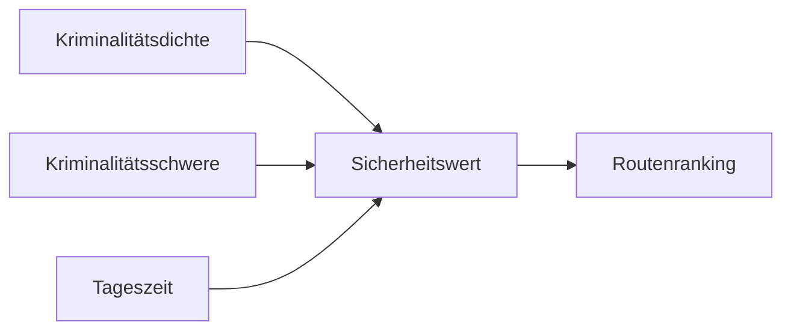

# **AstraaPath – Mehrsprachiges Navigationssystem für sichere Routen**

AstraaPath ist eine mehrsprachige, KI-unterstützte sicherheitsorientierte Navigationswebsite. Ein Benutzer gibt einen **Startpunkt** und ein **Ziel** ein, und das System analysiert **Kriminalitätsdatensätze**, **Berichte zur öffentlichen Sicherheit** und **von der Polizei veröffentlichte Informationen**, um die **sicherste mögliche Route** zu ermitteln — separat für **Tag-** und **Nachtbedingungen**.

AstraaPath umfasst auch eine **vollständige Website-Internationalisierung (i18n)** mit **react-i18next**, die es Benutzern ermöglicht, die Plattform nahtlos in mehreren Sprachen zu nutzen.

---

## 🌍 **Warum AstraaPath? (USP)**

* **Sicherheitsorientierte Navigation** — Anstatt nur die kürzeste Route zu berechnen, priorisiert AstraaPath kriminalitätsbewusste Routenführung.
* **Tag/Nacht-dynamische Routenauswahl** — Kriminalitätsschwere und Sicherheit variieren je nach Tageszeit; AstraaPath passt Empfehlungen entsprechend an.
* **Mehrsprachige Benutzeroberfläche** — Implementiert mit `i18next`, unterstützt schnelle Erweiterung auf über 40 Sprachen.
* **Datengesteuert** — Verwendet verifizierte öffentliche Datensätze und offizielle Polizeivorfallsberichte.
* **Moderner Stack** — Entwickelt mit **TypeScript**, **Vite**, **React** und **i18n** für Geschwindigkeit und Skalierbarkeit.
* **Zukunftssicher** — Konzipiert für die Integration von ML-Modellen zur Vorhersage in späteren Phasen.

---

---

# 🧭 **Wie AstraaPath funktioniert (Architekturübersicht)**

## 🔹 **1. Benutzereingabe-Ebene**

Benutzer gibt ein:

* Startpunkt
* Ziel

Eine Anfrage zur Routenbewertung wird generiert.

## 🔹 **2. Routengenerator**

AstraaPath ruft ab:

* Alle möglichen Routen zwischen Punkt A → Punkt B
* Straßenabschnitt-Metadaten

## 🔹 **3. Kriminalitäts-Sicherheits-Engine**

Jede Route wird bewertet anhand von:

* Kriminalitätshäufigkeit
* Kriminalitätsschwere
* Tageszeit-Gewichtung

Ein **Sicherheitswert** wird für jede Route berechnet.

## 🔹 **4. Beste-Pfad-Entscheidung**

Die Route mit dem **höchsten Sicherheitswert** (nicht die kürzeste) wird empfohlen.

## 🔹 **5. Mehrsprachige Ebene**

Die Benutzeroberfläche passt sich mit i18next sofort an jede gewählte Sprache an.

---

# 📊 **System-Flussdiagramm**



---

# 🌐 **Mehrsprachige Unterstützung (i18n)**

AstraaPath verwendet **react-i18next** für die vollständige Website-Übersetzung. 
Und readmelingoo für die Übersetzung von Komponenten und Dateien. 
Und Funktionen von Lingo.dev innerhalb von React-Komponenten, um die Bedürfnisse verschiedener Benutzer über Grenzen hinweg zu adressieren. 

Weitere können sofort durch Erstellen zusätzlicher `JSON`-Dateien hinzugefügt werden.

### 📌 Beispiel-Übersetzungsdatei (`en.json`)

```json
{
  "welcome": "Welcome to AstraaPath",
  "start": "Starting Point",
  "destination": "Destination",
  "findRoute": "Find Safest Route"
}
```
## Lokal ausführen

**Voraussetzungen:** Node.js
1. Setze den `GEMINI_API_KEY` in [.env.local](.env.local) auf deinen Gemini API-Schlüssel
---

# 🚀 **Erste Schritte**

### 1️⃣ Repository klonen

```bash
git clone https://github.com/Satyarth-Sahu17/AstraaPath.git
cd AstraaPath
```

### 2️⃣ Abhängigkeiten installieren

```bash
npm install
```

### 3️⃣ Projekt ausführen

```bash
npm run dev
```

dein Projekt wird auf einem Vite-Entwicklungsserver gestartet.

---

# 🧪 **Sicherheitsbewertungslogik (vereinfacht)**



Formel (Beispiel):

```
sicherheitswert = (1 / kriminalitätsdichte) * gewichtungTageszeit * schwerefaktor
```

---

# 📈 **Zukünftige Erweiterungen**

* Integration mit Live-Kriminalitätsberichts-APIs
* Prädiktive ML-Sicherheitsbewertung
* SOS-Notfallhilfe
* Heatmap-Overlays zur Kriminalitätsvisualisierung
* Offline-Navigationsunterstützung

---

# 🤝 **Mitwirken**

1. Repository forken
2. Feature-Branch erstellen
3. Änderungen committen
4. Pull-Request öffnen

---

# 📜 **Lizenz**
MIT-Lizenz

Copyright (c) 2025 Sree Vishishta, Shravani Dhuri & Satyarth Sahu.

Permission is hereby granted, free of charge, to any person obtaining a copy
of this software and associated documentation files (the "Software"), to deal
in the Software without restriction, including without limitation the rights 
to use, copy, modify, merge, publish, distribute, sublicense, and/or sell
copies of the Software, and to permit persons to whom the Software is 
furnished to do so, subject to the following conditions:

The above copyright notice and this permission notice shall 
be included in all copies or substantial portions of the Software.

THE SOFTWARE IS PROVIDED "AS IS", WITHOUT WARRANTY OF ANY KIND, 
EXPRESS OR IMPLIED, INCLUDING BUT NOT LIMITED TO THE WARRANTIES 
OF MERCHANTABILITY, FITNESS FOR A PARTICULAR PURPOSE AND NONINFRINGEMENT. 
IN NO EVENT SHALL THE AUTHORS OR COPYRIGHT HOLDERS BE LIABLE FOR ANY CLAIM, 
DAMAGES OR OTHER LIABILITY, WHETHER IN AN ACTION OF CONTRACT, TORT OR OTHERWISE, 
ARISING FROM, OUT OF OR IN CONNECTION WITH THE SOFTWARE OR THE USE OR OTHER 
DEALINGS IN THE SOFTWARE.

---

# 📬 **Kontakt**

Für Probleme oder Feature-Anfragen besuche:
**[https://github.com/Satyarth-Sahu17/AstraaPath/issues](https://github.com/Satyarth-Sahu17/AstraaPath/issues)**

---

AstraaPath — *Weil Sicherheit niemals optional sein sollte.*