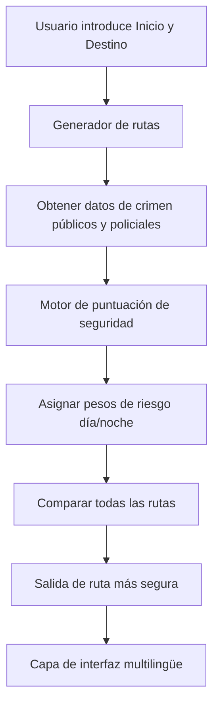
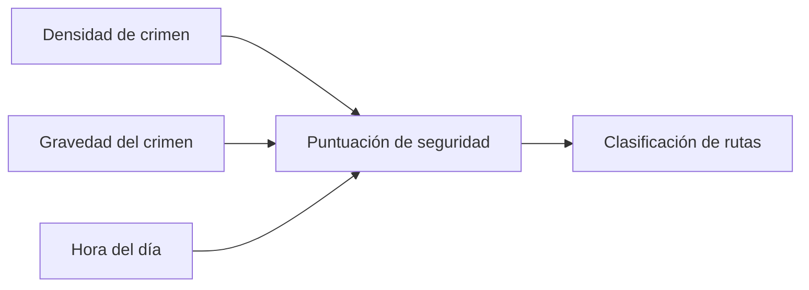

# **AstraaPath – Sistema de navegación multilingüe de rutas seguras**

AstraaPath es un sitio web de navegación multilingüe centrado en la seguridad y potenciado por IA. Un usuario introduce un **punto de partida** y un **destino**, y el sistema analiza **conjuntos de datos sobre delincuencia**, **informes de seguridad pública** e **información publicada por la policía** para determinar la **ruta más segura posible** — por separado para condiciones de **día** y **noche**.

AstraaPath también incluye **internacionalización completa del sitio web (i18n)** utilizando **react-i18next**, permitiendo a los usuarios utilizar la plataforma en múltiples idiomas sin problemas.

---

## 🌍 **¿Por qué AstraaPath? (USP)**

* **Navegación con prioridad en la seguridad** — En lugar de usar solo la lógica de ruta más corta, AstraaPath prioriza rutas conscientes del crimen.
* **Selección dinámica de rutas día/noche** — La gravedad del crimen y la seguridad varían según la hora; AstraaPath ajusta las recomendaciones en consecuencia.
* **Interfaz multilingüe** — Implementada con `i18next`, permitiendo una rápida expansión a más de 40 idiomas.
* **Basado en datos** — Utiliza conjuntos de datos públicos verificados y registros oficiales de incidentes policiales.
* **Stack moderno** — Construido con **TypeScript**, **Vite**, **React** e **i18n** para velocidad y escalabilidad.
* **Preparado para el futuro** — Diseñado para integrar modelos de ML para predicción en fases posteriores.

---

---

# 🧭 **Cómo funciona AstraaPath (Visión general de la arquitectura)**

## 🔹 **1. Capa de entrada del usuario**

El usuario introduce:

* Punto de partida
* Destino

Se genera una solicitud para la evaluación de la ruta.

## 🔹 **2. Generador de rutas**

AstraaPath obtiene:

* Todas las rutas posibles entre el Punto A → Punto B
* Metadatos de segmentos de carretera

## 🔹 **3. Motor de seguridad contra el crimen**

Cada ruta se evalúa utilizando:

* Frecuencia de crímenes
* Gravedad de crímenes
* Ponderación según hora del día

Se calcula una **Puntuación de seguridad** para cada ruta.

## 🔹 **4. Decisión de mejor ruta**

Se recomienda la ruta con la **puntuación de seguridad más alta** (no la más corta).

## 🔹 **5. Capa multilingüe**

La interfaz de usuario se adapta instantáneamente a cualquier idioma elegido usando i18next.

---

# 📊 **Diagrama de flujo del sistema**



---

# 🌐 **Soporte multilingüe (i18n)**

AstraaPath utiliza **react-i18next** para la traducción completa del sitio web.
Y readmelingoo para la traducción de componentes y archivos.
Y características de Lingo.dev dentro de los componentes de React para abordar las necesidades de varios usuarios a través de las fronteras.

Se pueden añadir más instantáneamente creando archivos `JSON` adicionales.

### 📌 Ejemplo de archivo de traducción (`en.json`)

```json
{
  "welcome": "Welcome to AstraaPath",
  "start": "Starting Point",
  "destination": "Destination",
  "findRoute": "Find Safest Route"
}
```
## Ejecutar localmente

**Requisitos previos:** Node.js
1. Establece el `GEMINI_API_KEY` en [.env.local](.env.local) con tu clave API de Gemini
---

# 🚀 **Primeros pasos**

### 1️⃣ Clonar el repositorio

```bash
git clone https://github.com/Satyarth-Sahu17/AstraaPath.git
cd AstraaPath
```

### 2️⃣ Instalar dependencias

```bash
npm install
```

### 3️⃣ Ejecutar el proyecto

```bash
npm run dev
```

tu proyecto se iniciará en un servidor de desarrollo Vite.

---

# 🧪 **Lógica de puntuación de seguridad (Simplificada)**



Fórmula (ejemplo):

```
puntuaciónSeguridad = (1 / densidadCrimen) * pesoPorHoraDelDía * factorGravedad
```

---

# 📈 **Mejoras futuras**

* Integración con APIs de informes de crímenes en vivo
* Puntuación de seguridad predictiva con ML
* Asistencia de emergencia SOS
* Superposiciones de mapas de calor para visualización de crímenes
* Soporte de navegación sin conexión

---

# 🤝 **Contribuir**

1. Haz un fork del repositorio
2. Crea una rama de características
3. Confirma tus cambios
4. Abre una solicitud de extracción

---

# 📜 **Licencia**
Licencia MIT

Copyright (c) 2025 Sree Vishishta, Shravani Dhuri & Satyarth Sahu.

Se concede permiso, de forma gratuita, a cualquier persona que obtenga una copia
de este software y archivos de documentación asociados (el "Software"), para tratar
el Software sin restricciones, incluyendo, sin limitación, los derechos
de usar, copiar, modificar, fusionar, publicar, distribuir, sublicenciar y/o vender
copias del Software, y permitir a las personas a quienes se les proporcione el Software
hacerlo, sujeto a las siguientes condiciones:

El aviso de copyright anterior y este aviso de permiso se
incluirán en todas las copias o partes sustanciales del Software.

EL SOFTWARE SE PROPORCIONA "TAL CUAL", SIN GARANTÍA DE NINGÚN TIPO,
EXPRESA O IMPLÍCITA, INCLUYENDO PERO NO LIMITADO A LAS GARANTÍAS
DE COMERCIABILIDAD, IDONEIDAD PARA UN PROPÓSITO PARTICULAR Y NO INFRACCIÓN.
EN NINGÚN CASO LOS AUTORES O TITULARES DE DERECHOS DE AUTOR SERÁN RESPONSABLES DE CUALQUIER RECLAMACIÓN,
DAÑOS U OTRA RESPONSABILIDAD, YA SEA EN UNA ACCIÓN DE CONTRATO, AGRAVIO O DE OTRO MODO,
QUE SURJA DE, O EN CONEXIÓN CON EL SOFTWARE O EL USO U OTROS
TRATOS EN EL SOFTWARE.

---

# 📬 **Contacto**

Para problemas o solicitudes de funciones, visita:
**[https://github.com/Satyarth-Sahu17/AstraaPath/issues](https://github.com/Satyarth-Sahu17/AstraaPath/issues)**

---

AstraaPath — *Porque la seguridad nunca debería ser opcional.*