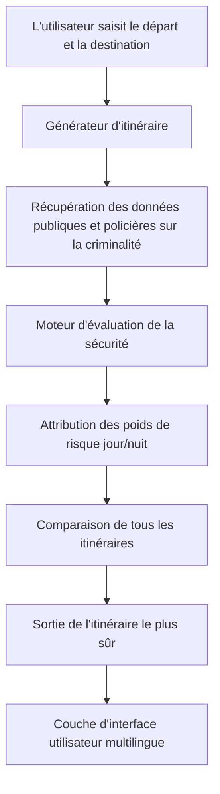
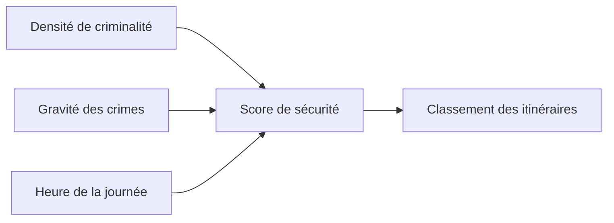

# **AstraaPath – Système de navigation multilingue pour itinéraires sécurisés**

AstraaPath est un site web de navigation multilingue, augmenté par l'IA et axé sur la sécurité. Un utilisateur entre un **point de départ** et une **destination**, et le système analyse les **ensembles de données sur la criminalité**, les **rapports de sécurité publique** et les **informations publiées par la police** pour déterminer l'**itinéraire le plus sûr possible** — séparément pour les conditions de **jour** et de **nuit**.

AstraaPath comprend également une **internationalisation complète du site web (i18n)** utilisant **react-i18next**, permettant aux utilisateurs d'utiliser la plateforme en plusieurs langues de manière transparente.

---

## 🌍 **Pourquoi AstraaPath ? (USP)**

* **Navigation axée sur la sécurité** — Au lieu d'une logique de trajet le plus court uniquement, AstraaPath priorise les itinéraires tenant compte de la criminalité.
* **Sélection dynamique d'itinéraire jour/nuit** — La gravité des crimes et la sécurité varient selon l'heure ; AstraaPath ajuste ses recommandations en conséquence.
* **Interface multilingue** — Implémentée avec `i18next`, permettant une expansion rapide à plus de 40 langues.
* **Basé sur les données** — Utilise des ensembles de données publiques vérifiées et des registres officiels d'incidents policiers.
* **Stack moderne** — Construit avec **TypeScript**, **Vite**, **React** et **i18n** pour la rapidité et l'évolutivité.
* **Prêt pour l'avenir** — Conçu pour intégrer des modèles d'apprentissage automatique pour la prédiction dans les phases ultérieures.

---

---

# 🧭 **Comment fonctionne AstraaPath (Aperçu de l'architecture)**

## 🔹 **1. Couche d'entrée utilisateur**

L'utilisateur entre :

* Point de départ
* Destination

Une demande est générée pour l'évaluation de l'itinéraire.

## 🔹 **2. Générateur d'itinéraire**

AstraaPath récupère :

* Tous les itinéraires possibles entre le point A → point B
* Métadonnées des segments routiers

## 🔹 **3. Moteur de sécurité contre la criminalité**

Chaque itinéraire est évalué en utilisant :

* Fréquence des crimes
* Gravité des crimes
* Pondération selon l'heure de la journée

Un **Score de sécurité** est calculé pour chaque itinéraire.

## 🔹 **4. Décision du meilleur chemin**

L'itinéraire avec le **score de sécurité le plus élevé** (pas le plus court) est recommandé.

## 🔹 **5. Couche multilingue**

L'interface utilisateur s'adapte instantanément à n'importe quelle langue choisie en utilisant i18next.

---

# 📊 **Diagramme de flux du système**



---

# 🌐 **Support multilingue (i18n)**

AstraaPath utilise **react-i18next** pour la traduction complète du site web.
Et readmelingoo pour la traduction des composants et des fichiers.
Et les fonctionnalités de Lingo.dev dans les composants React pour répondre aux besoins des différents utilisateurs à travers les frontières.

D'autres peuvent être ajoutés instantanément en créant des fichiers `JSON` supplémentaires.

### 📌 Exemple de fichier de traduction (`en.json`)

```json
{
  "welcome": "Welcome to AstraaPath",
  "start": "Starting Point",
  "destination": "Destination",
  "findRoute": "Find Safest Route"
}
```
## Exécution locale

**Prérequis :** Node.js
1. Définissez la `GEMINI_API_KEY` dans [.env.local](.env.local) avec votre clé API Gemini
---

# 🚀 **Pour commencer**

### 1️⃣ Cloner le dépôt

```bash
git clone https://github.com/Satyarth-Sahu17/AstraaPath.git
cd AstraaPath
```

### 2️⃣ Installer les dépendances

```bash
npm install
```

### 3️⃣ Exécuter le projet

```bash
npm run dev
```

votre projet démarrera sur un serveur de développement Vite.

---

# 🧪 **Logique de notation de sécurité (simplifiée)**



Formule (exemple) :

```
scoreDeSécurité = (1 / densitéDeCriminalité) * poidsMomentDeLaJournée * facteurDeGravité
```

---

# 📈 **Améliorations futures**

* Intégration avec des API de signalement de crimes en direct
* Notation de sécurité prédictive par apprentissage automatique
* Assistance d'urgence SOS
* Superpositions de cartes thermiques pour la visualisation des crimes
* Support de navigation hors ligne

---

# 🤝 **Contribuer**

1. Forkez le dépôt
2. Créez une branche de fonctionnalité
3. Committez vos modifications
4. Ouvrez une pull request

---

# 📜 **Licence**
Licence MIT

Copyright (c) 2025 Sree Vishishta, Shravani Dhuri & Satyarth Sahu.

L'autorisation est accordée, gratuitement, à toute personne obtenant une copie
de ce logiciel et des fichiers de documentation associés (le "Logiciel"), de traiter
le Logiciel sans restriction, y compris, sans limitation, les droits
d'utiliser, de copier, de modifier, de fusionner, de publier, de distribuer, de sous-licencier et/ou de vendre
des copies du Logiciel, et de permettre aux personnes à qui le Logiciel est
fourni de le faire, sous réserve des conditions suivantes :

L'avis de droit d'auteur ci-dessus et cet avis d'autorisation doivent
être inclus dans toutes les copies ou parties substantielles du Logiciel.

LE LOGICIEL EST FOURNI "TEL QUEL", SANS GARANTIE D'AUCUNE SORTE,
EXPRESSE OU IMPLICITE, Y COMPRIS, MAIS SANS S'Y LIMITER, LES GARANTIES
DE QUALITÉ MARCHANDE, D'ADÉQUATION À UN USAGE PARTICULIER ET DE NON-VIOLATION.
EN AUCUN CAS, LES AUTEURS OU LES DÉTENTEURS DU COPYRIGHT NE SERONT RESPONSABLES DE TOUTE RÉCLAMATION,
DOMMAGES OU AUTRE RESPONSABILITÉ, QUE CE SOIT DANS UNE ACTION DE CONTRAT, DE DÉLIT OU AUTRE,
DÉCOULANT DE, OU EN LIEN AVEC LE LOGICIEL OU L'UTILISATION OU D'AUTRES
TRANSACTIONS DANS LE LOGICIEL.

---

# 📬 **Contact**

Pour les problèmes ou les demandes de fonctionnalités, visitez :
**[https://github.com/Satyarth-Sahu17/AstraaPath/issues](https://github.com/Satyarth-Sahu17/AstraaPath/issues)**

---

AstraaPath — *Parce que la sécurité ne devrait jamais être optionnelle.*