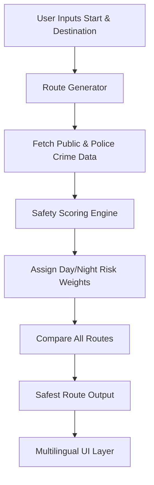
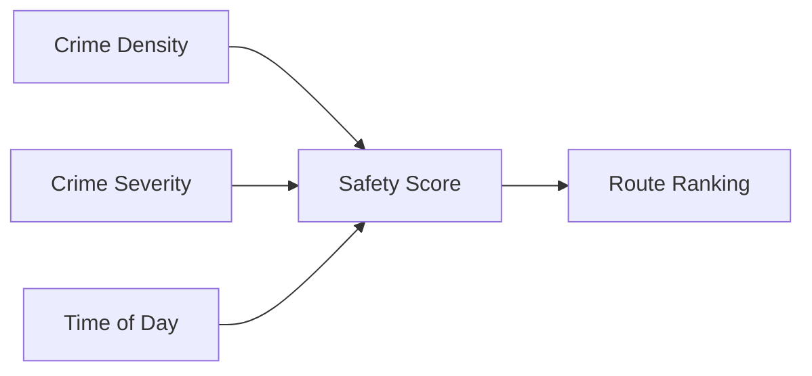

# **एस्ट्रापथ – बहुभाषी सुरक्षित-मार्ग नेविगेशन सिस्टम**

एस्ट्रापथ एक बहुभाषी, AI-संवर्धित सुरक्षा-केंद्रित नेविगेशन वेबसाइट है। उपयोगकर्ता एक **प्रारंभिक बिंदु** और एक **गंतव्य** दर्ज करता है, और सिस्टम **अपराध डेटासेट**, **सार्वजनिक सुरक्षा रिपोर्ट**, और **पुलिस-जारी जानकारी** का विश्लेषण करके **सबसे सुरक्षित संभव मार्ग** निर्धारित करता है — अलग से **दिन** और **रात** की स्थितियों के लिए।

एस्ट्रापथ में **react-i18next** का उपयोग करके **पूर्ण वेबसाइट अंतर्राष्ट्रीयकरण (i18n)** भी शामिल है, जिससे उपयोगकर्ता कई भाषाओं में निर्बाध रूप से प्लेटफॉर्म का उपयोग कर सकते हैं।

---

## 🌍 **एस्ट्रापथ क्यों? (USP)**

* **सुरक्षा-प्रथम नेविगेशन** — केवल सबसे छोटे-मार्ग तर्क के बजाय, एस्ट्रापथ अपराध-जागरूक मार्ग को प्राथमिकता देता है।
* **दिन/रात गतिशील मार्ग चयन** — अपराध की गंभीरता और सुरक्षा समय के अनुसार भिन्न होती है; एस्ट्रापथ तदनुसार सिफारिशों को समायोजित करता है।
* **बहुभाषी इंटरफेस** — `i18next` का उपयोग करके कार्यान्वित, 40+ भाषाओं में त्वरित विस्तार का समर्थन करता है।
* **डेटा-संचालित** — सत्यापित सार्वजनिक डेटासेट और आधिकारिक पुलिस घटना रिकॉर्ड का उपयोग करता है।
* **आधुनिक स्टैक** — गति और स्केलेबिलिटी के लिए **TypeScript**, **Vite**, **React**, और **i18n** के साथ निर्मित।
* **भविष्य-तैयार** — बाद के चरणों में पूर्वानुमान के लिए ML मॉडल को एकीकृत करने के लिए डिज़ाइन किया गया है।

---

---

# 🧭 **एस्ट्रापथ कैसे काम करता है (आर्किटेक्चर ओवरव्यू)**

## 🔹 **1. उपयोगकर्ता इनपुट लेयर**

उपयोगकर्ता दर्ज करता है:

* प्रारंभिक बिंदु
* गंतव्य

मार्ग मूल्यांकन के लिए एक अनुरोध उत्पन्न किया जाता है।

## 🔹 **2. मार्ग जनरेटर**

एस्ट्रापथ प्राप्त करता है:

* बिंदु A → बिंदु B के बीच सभी संभावित मार्ग
* सड़क-खंड मेटाडेटा

## 🔹 **3. अपराध-सुरक्षा इंजन**

प्रत्येक मार्ग का मूल्यांकन किया जाता है:

* अपराध आवृत्ति
* अपराध गंभीरता
* दिन के समय का भारांक

प्रत्येक मार्ग के लिए एक **सुरक्षा स्कोर** की गणना की जाती है।

## 🔹 **4. सर्वोत्तम पथ निर्णय**

**उच्चतम सुरक्षा स्कोर** वाले मार्ग (सबसे छोटा नहीं) की सिफारिश की जाती है।

## 🔹 **5. बहुभाषी लेयर**

UI i18next का उपयोग करके किसी भी चुनी गई भाषा में तुरंत अनुकूलित हो जाता है।

---

# 📊 **सिस्टम फ्लो डायग्राम**



---

# 🌐 **बहुभाषी समर्थन (i18n)**

एस्ट्रापथ पूर्ण वेबसाइट अनुवाद के लिए **react-i18next** का उपयोग करता है।
और कंपोनेंट्स और फाइलों के अनुवाद के लिए readmelingoo का उपयोग करता है।
और सीमाओं के पार विभिन्न उपयोगकर्ताओं की आवश्यकताओं को संबोधित करने के लिए रिएक्ट कंपोनेंट्स के भीतर Lingo.dev की सुविधाओं का उपयोग करता है।

अतिरिक्त `JSON` फाइलें बनाकर तुरंत और अधिक जोड़ा जा सकता है।

### 📌 अनुवाद फाइल उदाहरण (`en.json`)

```json
{
  "welcome": "Welcome to AstraaPath",
  "start": "Starting Point",
  "destination": "Destination",
  "findRoute": "Find Safest Route"
}
```
## स्थानीय रूप से चलाएँ

**पूर्वापेक्षाएँ:** Node.js
1. अपनी Gemini API कुंजी के लिए [.env.local](.env.local) में `GEMINI_API_KEY` सेट करें
---

# 🚀 **शुरू करें**

### 1️⃣ रिपॉजिटरी क्लोन करें

```bash
git clone https://github.com/Satyarth-Sahu17/AstraaPath.git
cd AstraaPath
```

### 2️⃣ निर्भरताएँ इंस्टॉल करें

```bash
npm install
```

### 3️⃣ प्रोजेक्ट चलाएँ

```bash
npm run dev
```

आपका प्रोजेक्ट Vite डेव सर्वर पर शुरू हो जाएगा।

---

# 🧪 **सुरक्षा स्कोरिंग लॉजिक (सरलीकृत)**



फॉर्मूला (उदाहरण):

```
safetyScore = (1 / crimeDensity) * weightTimeOfDay * severityFactor
```

---

# 📈 **भविष्य के सुधार**

* लाइव अपराध-रिपोर्टिंग API के साथ एकीकरण
* पूर्वानुमानित ML सुरक्षा स्कोरिंग
* SOS आपातकालीन सहायता
* अपराध विज़ुअलाइज़ेशन के लिए हीटमैप ओवरले
* ऑफलाइन नेविगेशन समर्थन

---

# 🤝 **योगदान**

1. रिपॉजिटरी को फोर्क करें
2. एक फीचर ब्रांच बनाएँ
3. अपने परिवर्तनों को कमिट करें
4. एक पुल रिक्वेस्ट खोलें

---

# 📜 **लाइसेंस**
MIT लाइसेंस

कॉपीराइट (c) 2025 श्री विशिष्ट, श्रावणी धुरी और सत्यार्थ साहू।

इस सॉफ्टवेयर और संबंधित दस्तावेज़ फ़ाइलों ("सॉफ्टवेयर") की एक प्रति प्राप्त करने वाले
किसी भी व्यक्ति को बिना किसी शुल्क के, अनुमति दी जाती है, बिना किसी प्रतिबंध के सॉफ्टवेयर
में व्यवहार करने के लिए, जिसमें बिना सीमा के उपयोग करने, कॉपी करने, संशोधित करने, विलय करने,
प्रकाशित करने, वितरित करने, सबलाइसेंस करने, और/या सॉफ्टवेयर की प्रतियां बेचने के अधिकार
शामिल हैं, और जिन व्यक्तियों को सॉफ्टवेयर प्रदान किया गया है उन्हें ऐसा करने की अनुमति देने के लिए,
निम्नलिखित शर्तों के अधीन:

उपरोक्त कॉपीराइट नोटिस और यह अनुमति नोटिस सॉफ्टवेयर की सभी प्रतियों या
पर्याप्त भागों में शामिल किया जाएगा।

सॉफ्टवेयर "जैसा है" प्रदान किया जाता है, बिना किसी प्रकार की वारंटी के,
व्यक्त या निहित, जिसमें व्यापारिकता की वारंटी, विशेष उद्देश्य के लिए
उपयुक्तता और गैर-उल्लंघन की वारंटी शामिल है लेकिन इन्हीं तक सीमित नहीं है।
किसी भी स्थिति में लेखक या कॉपीराइट धारक किसी भी दावे, क्षति या अन्य
देनदारी के लिए उत्तरदायी नहीं होंगे, चाहे वह अनुबंध की कार्रवाई में हो, टॉर्ट या अन्यथा,
सॉफ्टवेयर से उत्पन्न, या सॉफ्टवेयर के उपयोग या अन्य व्यवहारों से संबंधित हो।

---

# 📬 **संपर्क**

समस्याओं या फीचर अनुरोधों के लिए, यहां जाएं:
**[https://github.com/Satyarth-Sahu17/AstraaPath/issues](https://github.com/Satyarth-Sahu17/AstraaPath/issues)**

---

एस्ट्रापथ — *क्योंकि सुरक्षा कभी भी वैकल्पिक नहीं होनी चाहिए।*